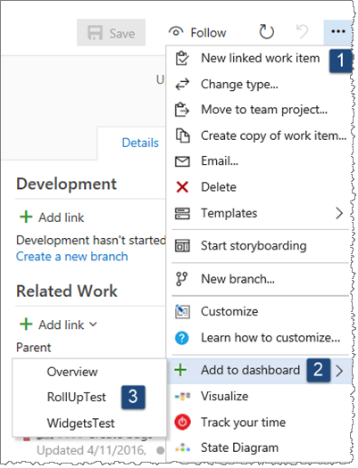

# Work-Item-Details-Widget-Extension

The **Work Item Details Widget** displays a card with some details of an Work item on your dashboards.

## Quick steps to get started

### Method 1

- Edit your dashboard [1]
- Select the 'Work item details' widget [2]
- Click Add to add the widget to your dashboard [3]
- Click Configure on the widget [4]

- Enter a Work Item Id and tab out of the text box [5]
- Click on Save [6]

### Method 2

- Select the context menu "..." on any work item list, work item dialog, or board [1]
- Select the item 'Add to dashboard' [2]
- Select the desired dashboard [3]

### Notes

- You can select multiple work items in a list
- On the dashboard, click on the widget to open the work item in a modal form 

## Contributors
We thank the following contributor(s) for this extension: Mikael Krief.

## Notices
Notices for certain third party software included in this solution are provided here: [Third Party Notice](ThirdPartyNotices.txt).

## Contribute
Contributions to Work Item Details Widget are welcome. Here is how you can contribute to Work Item Details Widget:  

- Submit bugs and help us verify fixes  
- Submit pull requests for bug fixes and features and discuss existing proposals   

Please refer to [Contribution guidelines](.github/CONTRIBUTING.md) and the [Code of Conduct](.github/COC.md) for more details.

## Data/Telemetry
This project collects usage data and sends it to Microsoft to help Microsoft improve its products and services. For more information about how Microsoft uses telemetry data, read the Microsoft [privacy statement](http://go.microsoft.com/fwlink/?LinkId=521839). 

This telemetry is used for A|B testing and troubleshooting. 

To turn off telemetry you need to fork this repo, publish, and use your own version of the project without replacing the \_\_InstrumentationKey\_\_ configuration key.
